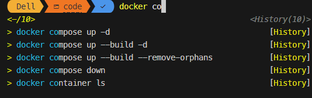

# Configurando o $profile

1. Abra o profile
```
notepad $profile
```

2. Escrever as configurações do profile
```
oh-my-posh init pwsh | Invoke-Expression
Set-Location $HOME\code\
Set-PSReadLineOption -PredictionSource History
Set-PSReadLineOption -PredictionViewStyle ListView
```

Cada linha
- Configura o posh para abrir no powershell
- Define a localizacao no qual deve abrir ao inicial
- Ver historico da sessão

